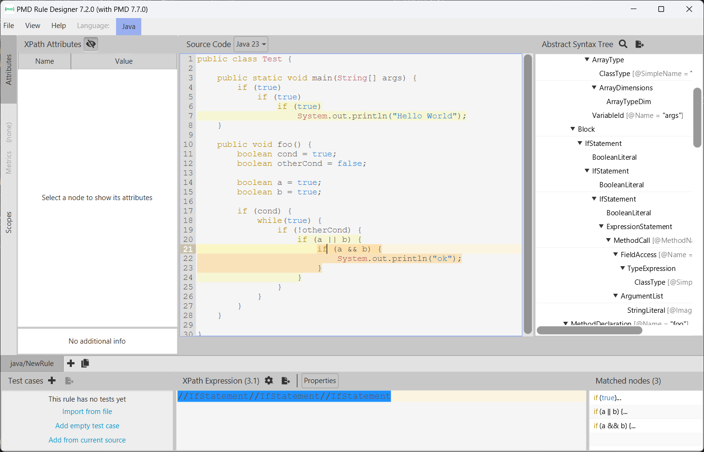

# Extending PMD

Use XPath to define a new rule for PMD to prevent complex code. The rule should detect the use of three or more nested `if` statements in Java programs so it can detect patterns like the following:

```Java
if (...) {
    ...
    if (...) {
        ...
        if (...) {
            ....
        }
    }

}
```
Notice that the nested `if`s may not be direct children of the outer `if`s. They may be written, for example, inside a `for` loop or any other statement.
Write below the XML definition of your rule.

You can find more information on extending PMD in the following link: https://pmd.github.io/latest/pmd_userdocs_extending_writing_rules_intro.html, as well as help for using `pmd-designer` [here](https://github.com/selabs-ur1/VV-ISTIC-TP2/blob/master/exercises/designer-help.md).

Use your rule with different projects and describe you findings below. See the [instructions](../sujet.md) 
for suggestions on the projects to use.

## Answer

In order to spot an imbrication of more of 3 ifs, we can create a rule based on the following
XPath request :

```xpath
//IfStatement//IfStatement//IfStatement
```

The purpose of each `//` is to search *any direct or indirect* child of the each XML node
from the XML Java AST. Therefore, nested `if` statement can be detected even if they
are contained in intermediate blocks (`for` loops, `while` loops)...

We obtain the following result in PMD designer :



In order to properly integrate this rule in PMD, we can extend any ruleset with
the following XML node (following the [documentation](https://docs.pmd-code.org/latest/pmd_userdocs_extending_writing_rules_intro.html)):

```xml
<rule name="TooMuchNestedIf"
    language="java"
    message="More than 3 if statements directly or undirectly nested." 
    class="net.sourceforge.pmd.lang.rule.xpath.XPathRule" >
    <description>
        There is more than 3 if statements which are directly or undirectly nested. 
        This discouraged as it reduce lisibility of the code.
    </description>
    <priority>3</priority> <!-- Non critical error, low priority -->
    <properties>
        <property name="xpath">
            <value>
                <![CDATA[
                    //IfStatement//IfStatement//IfStatement
                ]]>
            </value>
        </property>
    </properties>
</rule>
```

This rule in integrated in the [`my-ruleset.xml`](../ruleset/my-ruleset.xml) ruleset.
If we run `pmd check` on the class [`Test.java`](../example-sources/Test.java) :

```bash
pmd check -R ruleset/my-ruleset.xml -d code/Exercise3 -r code/Exercise3/report
```

We obtain the following results :

```
code\Exercise3\Test.java:7:	TooMuchNestedIf:	More than 3 if statements directly or undirectly nested.
code\Exercise3\Test.java:23:	TooMuchNestedIf:	More than 3 if statements directly or undirectly nested.
code\Exercise3\Test.java:24:	TooMuchNestedIf:	More than 3 if statements directly or undirectly nested.
code\Exercise3\Test.java:24:	TooMuchNestedIf:	More than 3 if statements directly or undirectly nested.
```

Nested if are effectively detected.

We can indeed check if there is such imbricated if in various projects. By
testing the ruleset on [Common Collections](../code/Exercise3/report_collections),
[Common Math](../code/Exercise3/report_math), [Common CLI](../code/Exercise3/report_cli) and
[Common Lang](../code/Exercise3/report_lang) (click on links to see reports). 
Results show there is numerous indirect or direct triple if statement imbrications.
