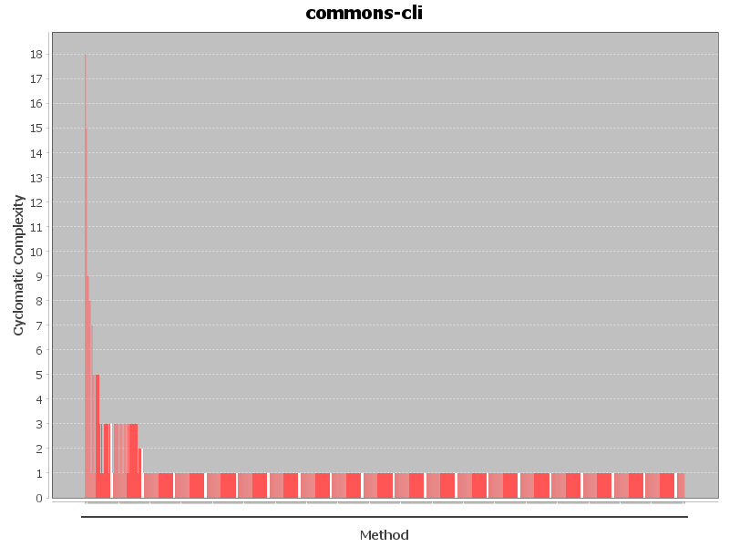
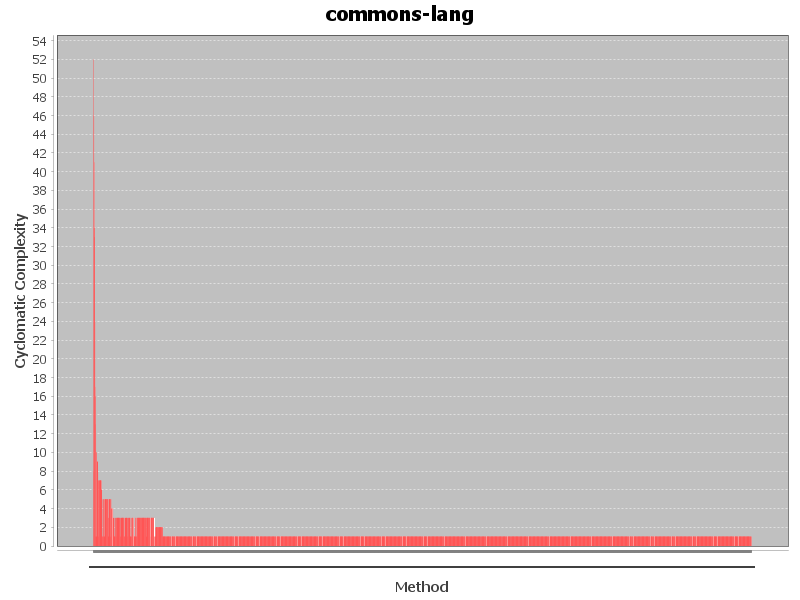

# Cyclomatic Complexity with JavaParser

With the help of JavaParser implement a program that computes the Cyclomatic Complexity (CC) of all methods in a given Java project. The program should take as input the path to the source code of the project. It should produce a report in the format of your choice (TXT, CSV, Markdown, HTML, etc.) containing a table showing for each method: the package and name of the declaring class, the name of the method, the types of the parameters and the value of CC.
Your application should also produce a histogram showing the distribution of CC values in the project. Compare the histogram of two or more projects.

Include in this repository the code of your application. Remove all unnecessary files like compiled binaries. Do include the reports and plots you obtained from different projects. See the [instructions](../sujet.md) for suggestions on the projects to use.

You may use [javaparser-starter](../code/javaparser-starter) as a starting point.

## Answers

See the code [here](../code/Exercise5/vv-tp2-ex5/). Analysis reports and
charts can also be found here.

### Run the progam

You can run the program through its main class `CyclomaticComplexity`. The program takes as argument
the path of the folder to analyze.

### Functionalities

The cyclomatic complexity analyzer includes the following functionalities :
- a cyclomatic complexity calculator
- CSV export
- PNG bar plot export using [JFreeChart](https://www.jfree.org/jfreechart/)

Reports are included at the root of the [exercise 5 code folder](../code/Exercise5/vv-tp2-ex5/).

### Implementation details

The program doesn't computes the cyclomatic complexity by reconstructing the entire control flow graph 
; instead, it calculates it by exploring each method code using the `CyclomaticComplexityVisitor`, 
which, for each control-flow modifying statement, calculates the number of vertices (= basic blocks of 
the program, i.e. sequences of non-branching statements) and the number of edges (= branchs) related to 
the statement. Final number is calculated when all statements of the method had been explored, using 
the cyclomatic complexity formula :

$$CC = E - N + 2$$

under the assumption that the control-flow graph of the method is connected.

For each compilation unit, the visitor `CyclomaticUnitVisitor` keep tracks of each method cyclomatic complexity which is computed. Results are stored in the forms of records in a list, shared between all visitors executed by the program.

Export is done by two classes, which implement both the `CycloExporter` interface : the class `CSVCycloExporter` export computed complexities in a CSV file, in descending order ; the class `BarplotCycloExporter` creates a bar plot from computed complexities, also order by descending complexities. Each `CycloExporter` use the cyclomatic complexity records list to produce the export.

### Experiments over Apache libraries.

We ran the cyclomatic complexity calculator over the following Apache libraries :

- Apache Commons CLI
- Apache Commons Collections
- Apache Commons Lang
- Apache Commons Math

The results are the following :

- For Apache Common CLI :

    

    Top 5 of the most complex methods : 

    | Package                     | Declaring class      | Method            | Params                                 | CC |
    |-----------------------------|----------------------|-------------------|----------------------------------------|----|
    | org.apache.commons.cli      | PatternOptionBuilder | getValueType      | (char ch)                              | 18 |
    | org.apache.commons.cli      | OptionValidatorTest  | setup             | ()                                     | 15 |
    | org.apache.commons.cli.help | TextHelpAppendable   | adjustTableFormat | (TableDefinition table)                | 9  |
    | org.apache.commons.cli      | OptionValidatorTest  | optionParameters  | ()                                     | 9  |
    | org.apache.commons.cli.help | TextStyle            | pad               | (boolean addIndent, CharSequence text) | 8  |

- For Apache Commons Collections :

    

    Top 5 of the most complex methods : 

    | Package                                   | Declaring class         | Method       | Params                                  | CC |
    |-------------------------------------------|-------------------------|--------------|-----------------------------------------|----|
    | org.apache.commons.collections4.list      | TreeListTest            | benchmark    | (List<? super Integer> l)               | 17 |
    | org.apache.commons.collections4.iterators | FilterListIteratorTest  | walkLists    | (List<E> list, ListIterator<E> testing) | 15 |
    | org.apache.commons.collections4.sequence  | SequencesComparatorTest | testShadok   | ()                                      | 13 |
    | org.apache.commons.collections4.set       | ListOrderedSet2Test     | testOrdering | ()                                      | 13 |
    | org.apache.commons.collections4.set       | ListOrderedSetTest      | testOrdering | ()                                      | 13 |

- For Apache Commons Lang : 

    

    Top 5 of the most complex methods : 

    | Package                       | Declaring class | Method               | Params                                         | CC |
    |-------------------------------|-----------------|----------------------|------------------------------------------------|----|
    | org.apache.commons.lang3.time | FastDatePrinter | parsePattern         | ()                                             | 52 |
    | org.apache.commons.lang3.time | FastDateParser  | getStrategy          | (char f, int width, Calendar definingCalendar) | 48 |
    | org.apache.commons.lang3      | Conversion      | hexDigitMsb0ToBinary | (char hexDigit)                                | 46 |
    | org.apache.commons.lang3      | Conversion      | hexDigitMsb0ToInt    | (char hexDigit)                                | 46 |
    | org.apache.commons.lang3      | Conversion      | hexDigitToBinary     | (char hexDigit)                                | 46 |

- For Apache Commons Math :

    

    Top 5 of the most complex methods : 

    | Package                                                | Declaring class                   | Method                 | Params | CC |
    |--------------------------------------------------------|-----------------------------------|------------------------|--------|----|
    | org.apache.commons.math4.legacy.analysis.interpolation | TricubicInterpolatingFunctionTest | testPreconditions      | ()     | 55 |
    | org.apache.commons.math4.legacy.core.jdkmath           | AccurateMathTest                  | testIntPowSpecialCases | ()     | 49 |
    | org.apache.commons.math4.legacy.core.jdkmath           | AccurateMathTest                  | testPowAllSpecialCases | ()     | 47 |
    | org.apache.commons.math4.legacy.linear                 | BlockFieldMatrixTest              | testSeveralBlocks      | ()     | 45 |
    | org.apache.commons.math4.legacy.linear                 | BlockRealMatrixTest               | testSeveralBlocks      | ()     | 45 |

For each project, there is only a small minority of methods which have really
big cyclomatic complexity (visible at the left of each graph). The vast majority
of found methods have the minimal cyclomatic complexity of 1 : CSV reports show
that the majority of these methods are getters / setters or test methods, which
are by defintion really frequent. We can emit the hypothesis that "ordinary"
logic of these libraries are concentrated at the "angle" between the most extreme
complexities.

Another remark we can do is that, while Commons Collections and Commons CLI 
methods have a maximal cyclomatic complexity of 17-18, this number is dramatically
higher in Commons Lang and Commons Math (52 and 55). This can be explained by the fact
that Commons Lang top methods are parsing methods, which have by design a lot of conditonal branchings, and Commons Math uses long successions of controls in its test cases (which is bad practice, as these controls actually test several cases).